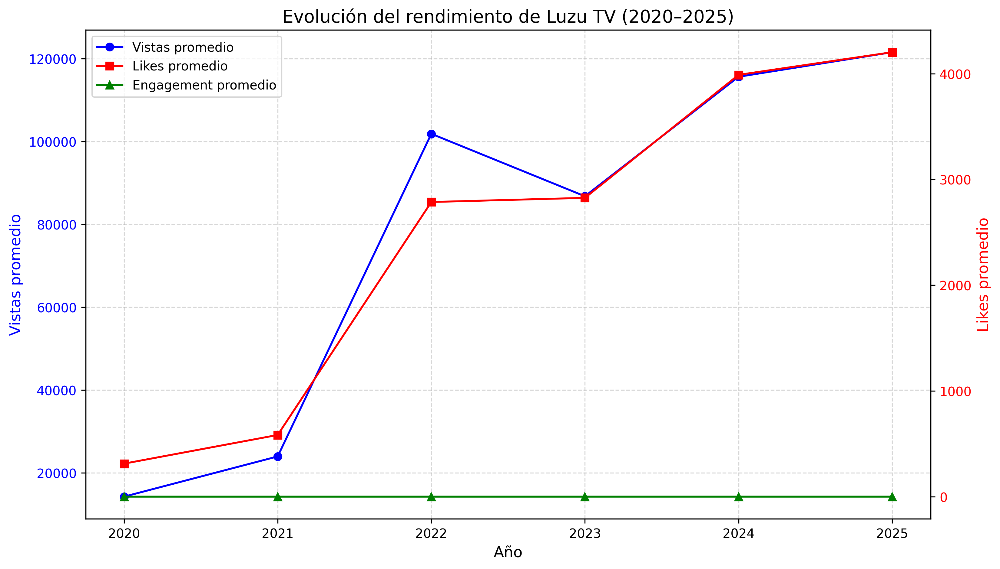
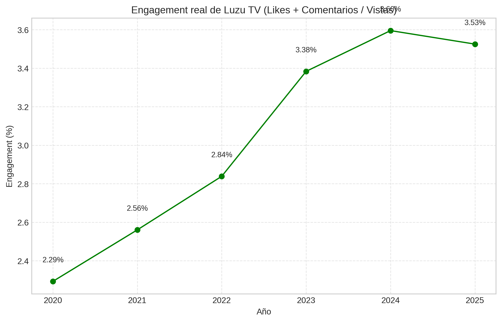
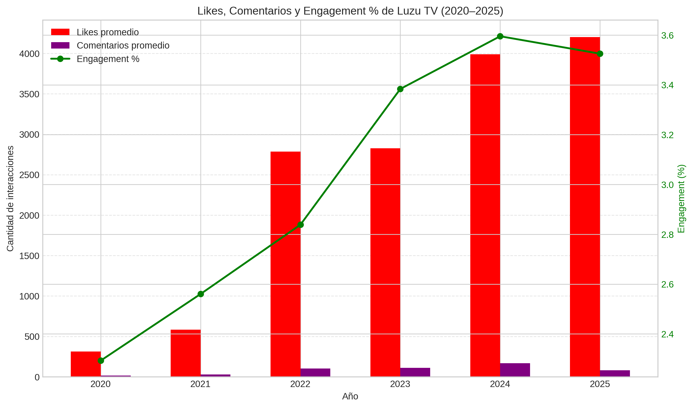
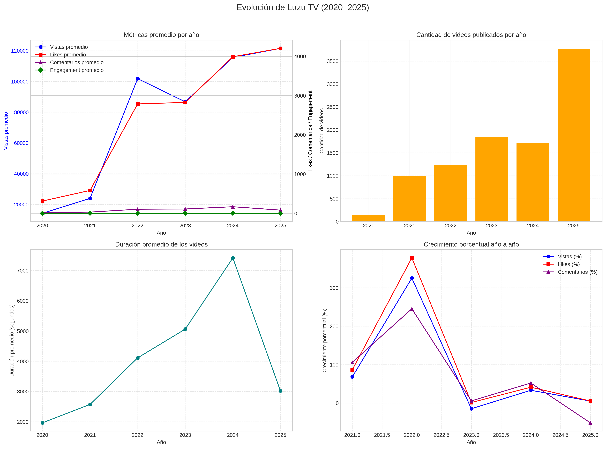
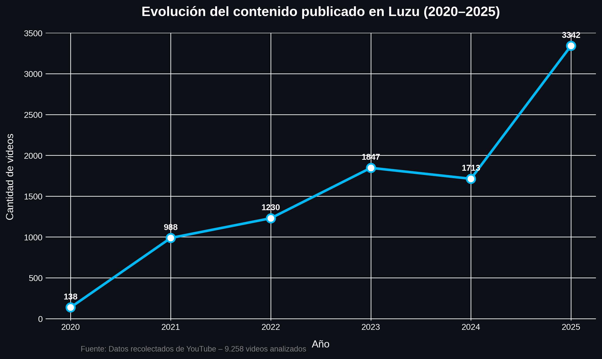
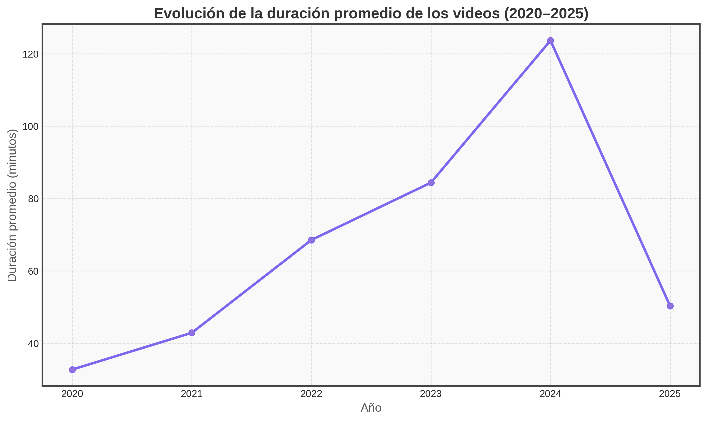
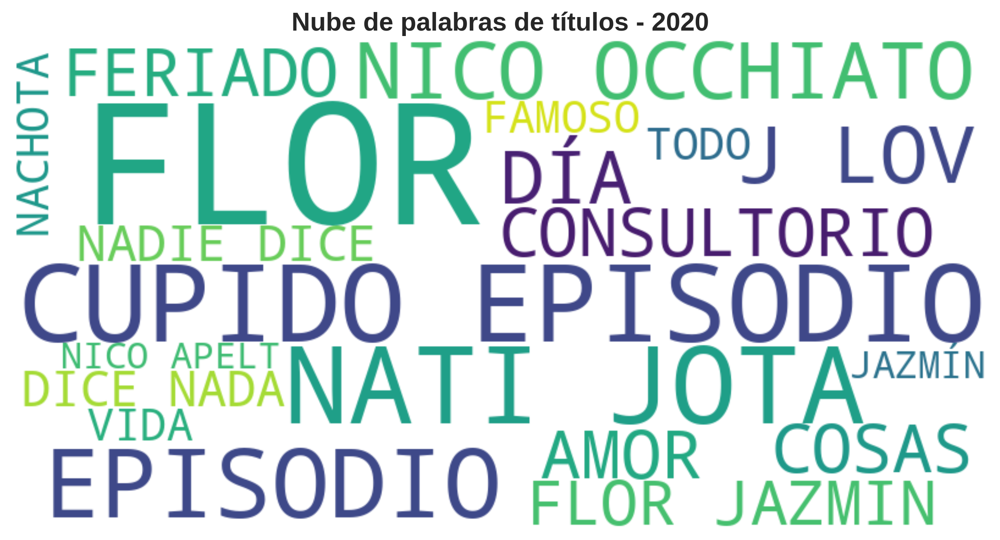

# Luzu TV — 5 Years of Evolution (YouTube API Analysis)

## An in-depth analysis of Luzu TV's growth over the last 5 years

This project analyzes the evolution of **Luzu TV** over a 5-year period using data extracted directly from the **YouTube Data API v3**.  
The goal is to understand how the channel grew in terms of content production, audience, engagement, and overall presence in the Argentine digital ecosystem.

---

## Data Source

All data used in this project was collected through the **YouTube Data API v3**, using Python to extract, process and analyze the information directly from YouTube endpoints.

No local dataset is included in this repository, as all information is retrieved dynamically from the API during execution.

---

## Objectives

- Analyze the channel’s evolution across a 5-year timeline  
- Study changes in video duration, upload volume and posting frequency  
- Measure growth in views, engagement and reach  
- Identify key patterns, peaks and transformations  
- Understand how the audience and community responded to the increasing content output  

---

## Tech Stack

- Python  
- Pandas  
- NumPy  
- Matplotlib  
- WordCloud  
- TQDM  
- YouTube Data API v3  
- Google Colab  

---

## Repository Structure
```
/notebooks
Luzu_5years_evolution.ipynb

/presentation
Luzu - 5 años de evolución.pdf

requirements.txt
```
---

## Key Findings

- **Content production increased steadily**, showing a clear strategic expansion of the channel’s digital presence.  
- **Audience growth mirrored production growth**, indicating a strong positive response from the community.  
- **Engagement remained high** even during periods of increased posting frequency, highlighting a loyal and active audience.  
- **Average video duration evolved**, adapting to new consumption trends while maintaining strong viewer retention.  
- **Interactions (likes, comments, views)** show a highly engaged community, with notable peaks tied to key content releases.  
- Overall, the patterns reveal that **Luzu TV deeply understands its audience** and continues to grow alongside it, strengthening its presence in the digital ecosystem.

---

## Key Visualizations

Below are the most representative visualizations from the analysis of **Luzu TV’s evolution (2020–2025)**.

---

### 🔵 Average Metrics per Year  


---

### 🟢 Engagement per Year  


---

### 🟣 Likes, Comments & Engagement Comparison  


---

### 🔶 Overall Yearly Overview  


---

### 🟦 Number of Videos Published per Year  


---

### 🟪 Average Video Duration per Year  


---

### 🟧 Word Clouds of Video Titles (2020–2025)  


---

> All visualizations and the full analysis can be found in the notebook:  
> **`notebooks/Luzu_5years_evolution.ipynb`**

---

## How to Reproduce

1. Clone or download the repository  
2. Install dependencies:
```
pip install -r requirements.txt
```
3. Run the notebook:
```
/notebooks/Luzu_5years_evolution.ipynb
```
